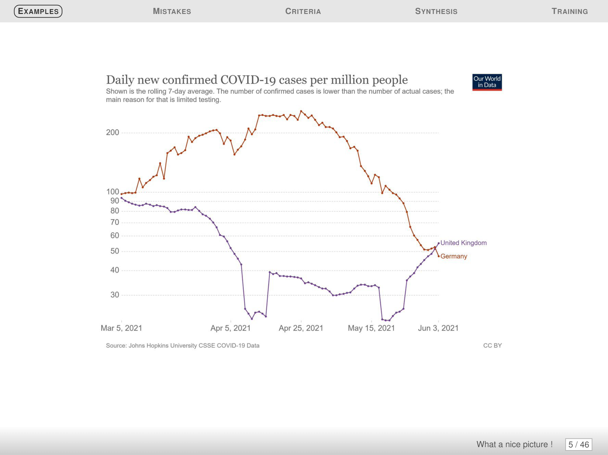

# Graph Critique Report

## Graph 1 :

### Data

[x] The type of the graphic is adapted to the nature of data (curve, bars, pie,
histogram, cloud...) 

[x] Approximations/interpolation make sense

[x] Curves are defined by a sufficient number of points

[x] The building method of the curve is clear : interpolation (linear, polynomial,regression...)

[ ] Confidence intervals are visualized (or given separately)

[ ] Steps of histograms are adequate

[ ] Histograms visualize probabilities (from 0 to 1)

### Graphical objects

[x] Graphical objects are readable on screen, on printed version (B/W), on
video...

[ ] Graphic range is standart, without too similar colors, without green (video)

[ ] Graphical axis are well identified and labelled

[ ] Scales and units are explicits

[x] Curves cross without ambiguity

[x] Grids help the reader

### Annotations

[x] Axis are labelled by quantities 

[ ] Labels of the axis are clear, and self contained

[ ] Units are indicated on the axis

[x] Axes are oriented from the left to the right and from the bottom to the
top

[ ] Origin is (0, 0), if not it should be clearly justified 

[ ] No hole on the axes

[ ] For bar graphs/histograms order of bars is based on classical ordering (alphabetical, temporal, from the best to the worse) are better than a random order

[x] Each curve has a legend

[ ] Each bar has a legend

### Information

[x] Curves are on the same scale

[x] The number of curves on a same graph is small (less than 6)

[x] Compare curves on a same graphic

[x] A curve cannot be removed without reducing the information

[x] The graphic gives a relevant information to the reader

[ ] If the vertical axis shows averages, it should indicates error bars

[ ] It is not possible to remove any objet without modifying the readability of the graphic

### Context

[ ] All the symbols are defined and referenced in the text

[x] The graphic produces more information than any other representation (choice of the variable)

[x] The graphic has a title

[x] The title is sufficiently self contained to partially understand the graphic

[ ] The graphic is referenced in the text

[x] The text comment the figure

## Graph 2 :

### Data

[x] The type of the graphic is adapted to the nature of data (curve, bars, pie,
histogram, cloud...) 

[x] Approximations/interpolation make sense

[x] Curves are defined by a sufficient number of points

[ ] The building method of the curve is clear : interpolation (linear, polynomial,regression...)

[ ] Confidence intervals are visualized (or given separately)

[ ] Steps of histograms are adequate

[ ] Histograms visualize probabilities (from 0 to 1)

### Graphical objects

[x] Graphical objects are readable on screen, on printed version (B/W), on
video...

[x] Graphic range is standart, without too similar colors, without green (video)

[x] Graphical axis are well identified and labelled

[x] Scales and units are explicits

[x] Curves cross without ambiguity

[x] Grids help the reader

### Annotations

[x] Axis are labelled by quantities 

[x] Labels of the axis are clear, and self contained

[ ] Units are indicated on the axis

[x] Axes are oriented from the left to the right and from the bottom to the
top

[ ] Origin is (0, 0), if not it should be clearly justified 

[x] No hole on the axes

[ ] For bar graphs/histograms order of bars is based on classical ordering (alphabetical, temporal, from the best to the worse) are better than a random order

[x] Each curve has a legend

[ ] Each bar has a legend

### Information

[ ] Curves are on the same scale

[x] The number of curves on a same graph is small (less than 6)

[x] Compare curves on a same graphic

[x] A curve cannot be removed without reducing the information

[x] The graphic gives a relevant information to the reader

[ ] If the vertical axis shows averages, it should indicates error bars

[x] It is not possible to remove any objet without modifying the readability of the graphic

### Context

[ ] All the symbols are defined and referenced in the text

[ ] The graphic produces more information than any other representation (choice of the variable)

[ ] The graphic has a title

[ ] The title is sufficiently self contained to partially understand the graphic

[ ] The graphic is referenced in the text

[ ] The text comment the figure

## Graph 3 :

### Data

[x] The type of the graphic is adapted to the nature of data (curve, bars, pie,
histogram, cloud...) 

[x] Approximations/interpolation make sense

[x] Curves are defined by a sufficient number of points

[x] The building method of the curve is clear : interpolation (linear, polynomial,regression...)

[ ] Confidence intervals are visualized (or given separately)

[ ] Steps of histograms are adequate

[ ] Histograms visualize probabilities (from 0 to 1)

### Graphical objects

[x] Graphical objects are readable on screen, on printed version (B/W), on
video...

[x] Graphic range is standart, without too similar colors, without green (video)

[ ] Graphical axis are well identified and labelled

[ ] Scales and units are explicits

[x] Curves cross without ambiguity

[x] Grids help the reader

### Annotations

[x] Axis are labelled by quantities 

[x] Labels of the axis are clear, and self contained

[ ] Units are indicated on the axis

[x] Axes are oriented from the left to the right and from the bottom to the
top

[x] Origin is (0, 0), if not it should be clearly justified 

[x] No hole on the axes

[ ] For bar graphs/histograms order of bars is based on classical ordering (alphabetical, temporal, from the best to the worse) are better than a random order

[x] Each curve has a legend

[ ] Each bar has a legend

### Information

[x] Curves are on the same scale

[x] The number of curves on a same graph is small (less than 6)

[x] Compare curves on a same graphic

[x] A curve cannot be removed without reducing the information

[x] The graphic gives a relevant information to the reader

[ ] If the vertical axis shows averages, it should indicates error bars

[x] It is not possible to remove any objet without modifying the readability of the graphic

### Context

[ ] All the symbols are defined and referenced in the text

[x] The graphic produces more information than any other representation (choice of the variable)

[x] The graphic has a title

[ ] The title is sufficiently self contained to partially understand the graphic

[ ] The graphic is referenced in the text

[ ] The text comment the figure
